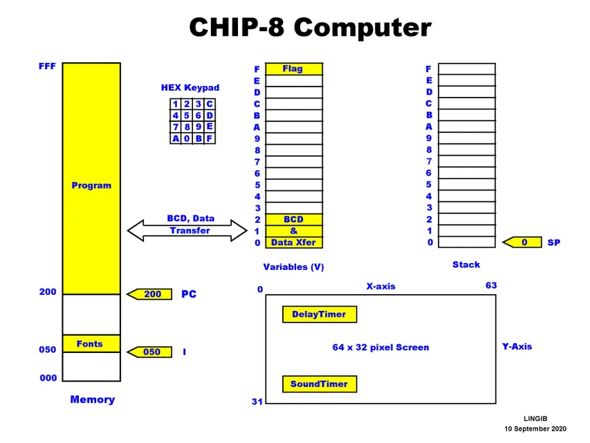

# CHIP-8 Interpreter

## References
* [1] Tobias V. Langhoff, ["How to write a CHIP-8 emulator"](https://tobiasvl.github.io/blog/write-a-chip-8-emulator/)
* [2] LINGIB, ["CHIP-8 Computer" Architecture Diagram](https://www.instructables.com/CHIP-8-Computer/)